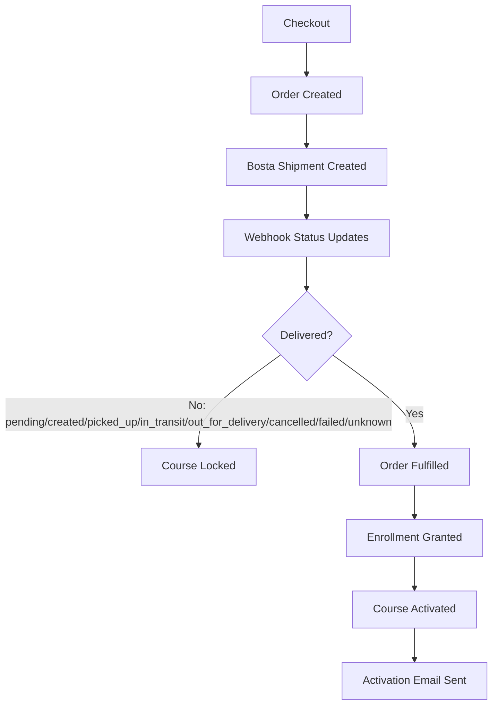

# Egypt Bosta Shipping & Course Activation

## 1. Overview

Science Street Lab sells physical science kits in Egypt that include course access. Delivery is handled by **Bosta**. Course enrollment must not unlock when the customer only pays or when an admin marks an order Shipped/Paid.

**Authoritative rule:** for Bosta-controlled orders (`orders.requires_delivery_fulfillment = true`), **Bosta `DELIVERED` is the only trigger that starts order fulfillment and course activation.**

The backend:

1. Creates a Bosta shipment at checkout (when enabled).
2. Accepts webhook status updates and maps them to internal `ShipmentStatus`.
3. On internal `delivered`, runs `OrderFulfillmentService::fulfillFromBostaDelivery`.
4. Dispatches `OrderFulfilled` → enrollment + confirmation email.
5. Exposes a frontend-safe `shipping` object on authenticated order APIs so the UI can render a progress tracker without re-implementing business rules.

---

## 2. Business Flow



Non-delivered states (including admin Paid/Shipped on delivery-gated orders) keep the course locked.

---

## 3. Shipping Status Lifecycle

| Internal Status | Customer Label (EN) | Description | Course Access | Terminal? |
|-----------------|---------------------|-------------|---------------|-----------|
| `pending` | Pending | Shipment row exists; provider create may be deferred/blocked | Locked | No |
| `created` | Shipment Created | Provider accepted / fake shipment created | Locked | No |
| `picked_up` | Picked Up | Courier collected the package | Locked | No |
| `in_transit` | In Transit | Package moving in the network | Locked | No |
| `out_for_delivery` | Out for Delivery | Last-mile delivery attempt | Locked | No |
| `delivered` | Delivered | Provider confirmed delivery; fulfillment starts | Processing → Active after `fulfilled_at` | Yes (success) |
| `cancelled` | Cancelled | Shipment cancelled | Locked | Yes (failure) |
| `failed` | Delivery Failed | Delivery failed / returned / rejected | Locked | Yes (failure) |
| `unknown` | Status Updating | Unrecognized provider status; never treated as delivered | Locked | No |

Labels come from `lang/{en,ar}/shipping.php` via `ShipmentStatus::label()` and `Accept-Language`.

---

## 4. Customer Shipping Steps

The API returns seven presentation steps (not raw Bosta enums):

1. **Order Placed** — always completed when the order exists (`orders.created_at`)
2. **Shipment Created** — completed when internal rank ≥ `created`
3. **Picked Up**
4. **In Transit**
5. **Out for Delivery**
6. **Delivered** — shipping success
7. **Course Activated** — application status; completed only when `orders.fulfilled_at` is set

Difference:

- **Shipping status** (`shipping.status`) is the normalized shipment lifecycle.
- **Course activation** is fulfillment/enrollment state. Delivery alone yields `course_access.status = processing` until `fulfilled_at` is set.

**Tracker rule:** the journey step that matches the current shipment status is marked `current` (●). Steps before it are `completed` (✓). Steps after it are `pending` (○). After `delivered` while fulfillment is still running, Delivered is `completed` and Course Activated is `current`.

Optional future UI concepts such as “Preparing Order” / “Ready for Pickup” are **not** persisted statuses today. Do not invent them in the API.

---

## 5. Status Mapping

`BostaStatusMapper` normalizes provider strings (lowercase, spaces/hyphens → underscores).

| Bosta Provider Status (examples) | Internal `ShipmentStatus` | Notes |
|----------------------------------|---------------------------|-------|
| `pending`, `new`, `created`, `pickup_requested`, `awaiting_pickup` | `created` | **Provisional** until official Bosta docs confirm |
| `picked_up`, `pickedup`, `collected` | `picked_up` | Provisional |
| `in_transit`, `intransit`, `shipped`, `on_the_way` | `in_transit` | Provisional |
| `out_for_delivery`, `outfordelivery` | `out_for_delivery` | Provisional |
| `delivered`, `delivery_confirmed`, `completed` | `delivered` | Provisional synonyms; `delivered` is the unlock gate |
| `cancelled`, `canceled` | `cancelled` | Provisional |
| `failed`, `returned`, `rejected` | `failed` | Provisional |
| anything else / empty | `unknown` | Safe default — never unlocks |

These mappings are **not** guaranteed official Bosta behavior until staging credentials and official status documentation are provided.

---

## 6. Database Structure

### `shipments` table

Migration: `app/Modules/Commerce/Infrastructure/Persistence/Migrations/2026_10_01_100001_create_shipments_table.php`

| Column | Purpose |
|--------|---------|
| `order_id` | FK to `orders` |
| `provider` | e.g. `bosta` |
| `external_shipment_id` | Provider shipment id (nullable if create blocked) |
| `tracking_number` | Optional tracking code from provider |
| `tracking_url` | Optional URL **only if provider returned it** |
| `status` | Internal `ShipmentStatus` value |
| `provider_status` | Last raw provider status string |
| `shipped_at` | Set on first mid-journey progress (picked_up / in_transit / out_for_delivery) |
| `delivered_at` | Set when mapped to delivered |
| `last_webhook_at` | Last webhook processing time |
| `metadata` | Internal only — **never exposed on customer API** |

Unique constraints:

- `(provider, external_shipment_id)`
- `(order_id, provider)` — one Bosta shipment per order

### Relevant `orders` fields

| Column | Purpose |
|--------|---------|
| `requires_delivery_fulfillment` | When true, fulfillment waits for Bosta delivered |
| `paid_at` | Payment accounting (`OrderPaid`) |
| `fulfilled_at` | Course access granted (`OrderFulfilled`) |
| `delivered_at` | Order-level delivered timestamp |
| `shipped_at` | May be set by admin ship without unlocking gated orders |

---

## 7. Shipment Creation

Flow:

`CheckoutService` → `BostaShipmentService::ensureShipmentForOrder` → `BostaClientInterface::createShipment` → persist `Shipment` → set `requires_delivery_fulfillment = true`.

Idempotency:

- Lookup existing `(order_id, provider = bosta)` inside a transaction with order row lock.
- Re-calling `ensureShipmentForOrder` returns the same row.
- Unique DB constraints prevent duplicate provider shipments.

If the real HTTP client is blocked (`BOSTA_API_CONTRACT_READY=false` / missing credentials), a `pending` shipment may be stored with metadata marking the block. Tests use `FakeBostaClient` (`BOSTA_USE_FAKE` / testing env).

---

## 8. Webhook Processing

**Route:** `POST /api/v1/webhooks/bosta`  
**Controller:** `BostaWebhookController`  
**Service:** `BostaWebhookService`

Behavior:

1. Return 404 if `bosta.enabled` is false.
2. Verify request via `BostaWebhookVerifierInterface` (fake header secret in tests; real signature blocked until `BOSTA_WEBHOOK_SIGNATURE_READY`).
3. Extract external shipment id and provider status from flexible payload keys.
4. Lock shipment row; map status; persist `provider_status`, `last_webhook_at`, sanitized payload snippet in `metadata`.
5. **Never downgrade** from `delivered`.
6. On first transition to `delivered`: set `delivered_at`, dispatch `ShipmentDelivered`, call `OrderFulfillmentService::fulfillFromBostaDelivery`.

Duplicate `DELIVERED` webhooks are idempotent: second pass sees `alreadyDelivered` and skips re-fulfillment.

---

## 9. DELIVERED Fulfillment

```
BostaWebhookService
  → OrderFulfillmentService::fulfillFromBostaDelivery
    → markPaid (COD / unpaid edge)
    → set order status Delivered + delivered_at
    → fulfill() → fulfilled_at + OrderFulfilled
      → GrantEnrollmentOnOrderFulfilled
      → EnrollUserService / CoursePlan entitlement
      → SendOrderConfirmationEmail (after fulfilled_at)
```

**Why `OrderPaid` ≠ `OrderFulfilled`:**

- `OrderPaid` records payment.
- `OrderFulfilled` grants learning access and confirmation email.
- For delivery-gated Egypt kits, payment can succeed while enrollment stays locked until Bosta delivered.

Admin `applyAdminUpdate` on gated orders updates status/notes only and **does not** call `fulfill()`.

---

## 10. Course Access Rules

| Situation | Course Access |
|-----------|---------------|
| Order created | Locked |
| Shipment created | Locked |
| Picked up / in transit / out for delivery | Locked |
| Admin marks Paid / Shipped (gated order) | Locked |
| Bosta delivered, `fulfilled_at` still null | `processing` |
| Enrollment / fulfillment success (`fulfilled_at` set) | `active` |
| Cancelled | Locked |
| Failed | Locked |
| Unknown | Locked |

Source of truth for `active`: **`orders.fulfilled_at`** (and resulting enrollment), not admin order status alone.

API shape:

```json
"course_access": {
  "status": "locked|processing|active",
  "unlocks_on": "delivered",
  "message": "…"
}
```

Non-gated orders return `shipping.required = false` and `course_access.status` of `active` or `not_applicable`.

---

## 11. Shipping Status API

| | |
|--|--|
| **Method** | `GET` |
| **Routes** | `/api/v1/orders` (list), `/api/v1/orders/{orderNumber}` (detail) |
| **Auth** | Sanctum (`auth:sanctum`) |
| **Authorization** | Scoped to `orders.user_id = auth id` (404 for other users’ orders) |

Presenter: `OrderShippingPresenter`  
Controller: `OrderController` (embeds `shipping`, strips raw `bosta_shipment`)

### In Transit Example

The step matching `shipping.status` is marked `current`. Prior steps are `completed`.

```json
{
  "data": {
    "order_number": "ORD-…",
    "shipping": {
      "required": true,
      "provider": "bosta",
      "status": "in_transit",
      "status_label": "In Transit",
      "tracking_number": "fake-track-123",
      "tracking_url": "https://bosta.example/track/…",
      "shipped_at": "2026-09-24T10:00:00+00:00",
      "delivered_at": null,
      "course_access": {
        "status": "locked",
        "unlocks_on": "delivered",
        "message": "Course access unlocks when the shipment is delivered."
      },
      "progress": {
        "current_step": 4,
        "total_steps": 7,
        "percentage": 43,
        "halted": false,
        "halt_reason": null
      },
      "steps": [
        { "key": "order_placed", "label": "Order Placed", "status": "completed", "completed_at": "…" },
        { "key": "shipment_created", "label": "Shipment Created", "status": "completed", "completed_at": "…" },
        { "key": "picked_up", "label": "Picked Up", "status": "completed", "completed_at": "…" },
        { "key": "in_transit", "label": "In Transit", "status": "current", "completed_at": null },
        { "key": "out_for_delivery", "label": "Out for Delivery", "status": "pending", "completed_at": null },
        { "key": "delivered", "label": "Delivered", "status": "pending", "completed_at": null },
        { "key": "course_activated", "label": "Course Activated", "status": "pending", "completed_at": null }
      ]
    }
  }
}
```

`progress.percentage` = `round(completed_steps / total_steps * 100)` (current step is highlighted, not counted as completed).

| Status | Current step key | `current_step` | Completed count | `percentage` |
|--------|------------------|----------------|-----------------|--------------|
| `created` | `shipment_created` | 2 | 1 | 14 |
| `picked_up` | `picked_up` | 3 | 2 | 29 |
| `in_transit` | `in_transit` | 4 | 3 | 43 |
| `out_for_delivery` | `out_for_delivery` | 5 | 4 | 57 |
| `delivered` (processing) | `course_activated` | 7 | 6 | 86 |
| fulfilled | — (all completed) | 7 | 7 | 100 |

### Delivered Example (before fulfillment finishes)

`status`: `delivered`, delivered step `completed`, `course_access.status`: `processing`, `course_activated` step: `current`.

### Fulfilled Example

All seven steps `completed`, `course_access.status`: `active`, `progress.percentage`: `100`.

### Cancelled Example

`status`: `cancelled`, `course_access.status`: `locked`, `progress.halted`: `true`, `halt_reason`: `cancelled`, first incomplete journey step marked `failed`.

---

## 12. Frontend Integration

Render from backend fields; do **not** decide unlock logic in the client.

| Field | Use |
|-------|-----|
| `shipping.status` | Normalized internal status code |
| `shipping.status_label` | Localized human label |
| `shipping.steps` | Primary tracker UI (`completed` / `current` / `pending` / `failed`) |
| `shipping.progress` | Optional bar (`current_step`, `total_steps`, `percentage`, `halted`) |
| `shipping.tracking_number` / `tracking_url` | Show only when non-null |
| `shipping.course_access` | Lock banner / unlock messaging |

**Frontend MUST NOT** unlock course UI solely because order status is Paid/Shipped. Trust `course_access` and learning enrollment APIs.

Practical FE guide: [`EGYPT_BOSTA_SHIPPING_FRONTEND.md`](EGYPT_BOSTA_SHIPPING_FRONTEND.md).

---

## 13. Frontend UI Example

Conceptual:

```
✓ Order Placed
✓ Shipment Created
✓ Picked Up
● In Transit
○ Out for Delivery
○ Delivered
○ Course Activated
```

- `✓` = `steps[].status === "completed"`
- `●` = `current`
- `○` = `pending`
- Failed/cancelled: show halted state from `progress.halted` / step `failed`; keep course locked messaging.

---

## 14. Tracking URL

`tracking_url` is returned only when persisted from the Bosta client response (or attach helpers). The backend never fabricates a tracking URL from tracking numbers.

If missing: both `tracking_number` and `tracking_url` may be `null`.

---

## 15. Security

- Webhook verification via configured verifier; unsigned/blocked when signature contract not ready.
- Customer order routes enforce ownership (`user_id`).
- Secrets live in env (`BOSTA_API_KEY`, `BOSTA_WEBHOOK_SECRET`) — never in API responses.
- Customer `shipping` payload excludes `metadata`, webhook payloads, `provider_status`, and raw `bosta_shipment` relations.
- Logs must not print API keys or webhook secrets.

---

## 16. Idempotency

| Risk | Protection |
|------|------------|
| Duplicate shipment creation | `(order_id, provider)` unique + service lookup |
| Duplicate webhooks | Row lock; delivered never downgraded |
| Duplicate DELIVERED fulfillment | `alreadyDelivered` + `fulfilled_at` guard |
| Duplicate enrollment | Enrollment uniqueness / listener idempotency |
| Duplicate confirmation emails | Claim / `fulfilled_at` gating in mail listener |

---

## 17. Environment Variables

Names only (never commit values):

```
BOSTA_ENABLED=
BOSTA_API_URL=
BOSTA_API_KEY=
BOSTA_WEBHOOK_SECRET=
BOSTA_USE_FAKE=
BOSTA_API_CONTRACT_READY=
BOSTA_WEBHOOK_SIGNATURE_READY=
```

Config file: `config/bosta.php`.

---

## 18. Current External Blockers

Still required from Bosta / ops:

- Staging credentials
- Official create-shipment API documentation
- Official webhook payload + signature specification
- Official canonical status list (to replace provisional mapper entries)

Until then: use Fake client in tests/local; production HTTP client refuses real calls when `BOSTA_API_CONTRACT_READY` is false.

---

## 19. Testing

Covered by:

- `tests/Feature/BostaShippingFulfillmentTest.php` — shipment create, pay-without-enroll, delivered unlock, admin cannot bypass, duplicate webhook, webhook auth, non-kit still fulfills on pay
- `tests/Feature/OrderShippingStatusApiTest.php` — shipping payload, step progression, course_access states, cancelled/failed/unknown, tracking URL, authorization, no metadata leak, Arabic labels

Commands:

```bash
php artisan test --filter=Bosta
php artisan test --filter=OrderShippingStatusApiTest
php artisan test
```

Latest local run (this change set):

```text
php artisan test --filter=Bosta
→ 7 passed

php artisan test --filter=OrderShippingStatusApiTest
→ 18 passed

php artisan test
→ 215 passed, 9 failed (failures are outside Bosta/shipping-status coverage:
  QuestionBankSystemTest, CertificateGamificationFlowTest, CheckoutFlowTest,
  CompetitionFlowTest ×2, CoursePlanSystemTest, ElearningApiGapsTest,
  LearningFlowTest, MyFatoorahPaymentTest)
```

---

## 20. Troubleshooting

| Case | Possible cause | Inspect |
|------|----------------|---------|
| Shipment not created | `BOSTA_ENABLED=false`; non-kit cart; create exception | Order items types; `shipments` row; logs `Bosta shipment creation deferred` (no secrets) |
| Webhook rejected | Disabled; verifier failed | `bosta.enabled`, `webhook_signature_ready`, request auth headers |
| Webhook shipment not found | Wrong external id | `shipments.external_shipment_id` vs payload keys |
| Unknown Bosta status | Mapper default | `provider_status` on shipment; extend mapper only with confirmed docs |
| Delivered but course not active | Fulfillment/enrollment failure after deliver | `orders.fulfilled_at`, enrollments, failed job / error logs |
| Duplicate webhook | Expected | Same `fulfilled_at`, single enrollment |
| Tracking URL missing | Provider did not return URL / create blocked | `shipments.tracking_url` column only |

---

## 21. Developer File Map

| File | Responsibility |
|------|----------------|
| `Domain/Enums/ShipmentStatus.php` | Internal lifecycle + ranks + labels |
| `Domain/Enums/ShipmentProvider.php` | Provider enum (`bosta`) |
| `Infrastructure/Persistence/Models/Shipment.php` | Shipment Eloquent model |
| `Infrastructure/Persistence/Models/Order.php` | Order + `bostaShipment` relation + fulfillment flags |
| `Infrastructure/Shipping/Bosta/BostaStatusMapper.php` | Provider → internal status |
| `Infrastructure/Shipping/Bosta/FakeBostaClient.php` | Test/local shipment create |
| `Infrastructure/Shipping/Bosta/HttpBostaClient.php` | Real HTTP client (blocked until contract ready) |
| `Infrastructure/Shipping/Bosta/*WebhookVerifier*` | Webhook auth |
| `Application/Services/BostaShipmentService.php` | Idempotent shipment create |
| `Application/Services/BostaWebhookService.php` | Idempotent webhook processing |
| `Application/Services/OrderFulfillmentService.php` | Paid vs fulfilled; Bosta deliver path; admin gate |
| `Application/Services/CheckoutService.php` | Checkout + shipment ensure |
| `Application/Support/OrderShippingPresenter.php` | Frontend shipping tracker payload |
| `Http/Controllers/Api/OrderController.php` | Customer orders + shipping embed |
| `Http/Controllers/Api/BostaWebhookController.php` | Webhook HTTP entry |
| `Domain/Events/ShipmentDelivered.php` | Delivered domain event |
| `Domain/Events/OrderFulfilled.php` | Fulfillment domain event |
| `Learning/.../GrantEnrollmentOnOrderFulfilled.php` | Enrollment on fulfill |
| `Commerce/.../SendOrderConfirmationEmail.php` | Post-fulfill confirmation mail |
| `lang/en/shipping.php` / `lang/ar/shipping.php` | Customer labels |
| `config/bosta.php` | Feature flags and credentials wiring |
| `Routes/api.php` (Commerce) | Orders + webhook routes |

---

## 22. Known Limitations / Future Work

- Real Bosta HTTP create-shipment contract still pending official docs/credentials.
- Webhook signature algorithm pending (`BOSTA_WEBHOOK_SIGNATURE_READY`).
- Status mapper entries remain provisional until official status list is confirmed.
- Frontend must consume `shipping` on order detail/list; no dedicated separate tracking micro-endpoint was added (existing order APIs were extended).
- Presentation does not invent “Preparing” / “Ready for Pickup” without persisted distinctions.
